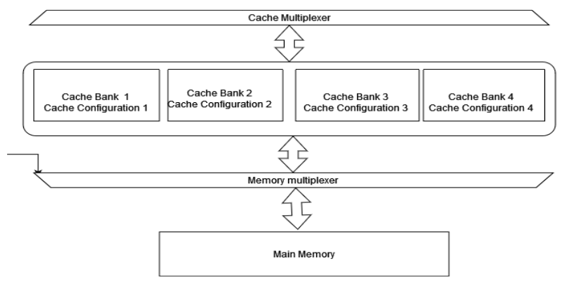
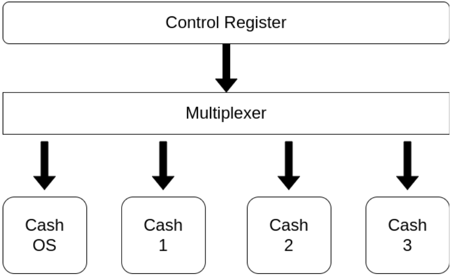
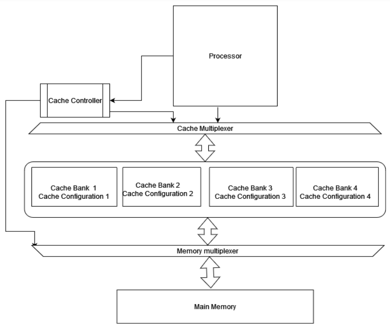
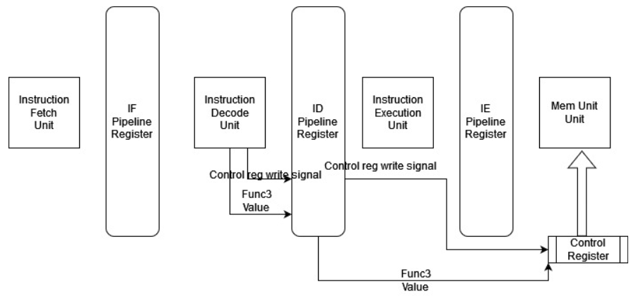
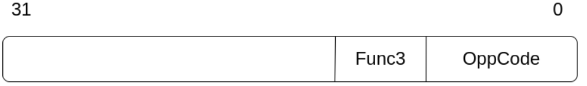
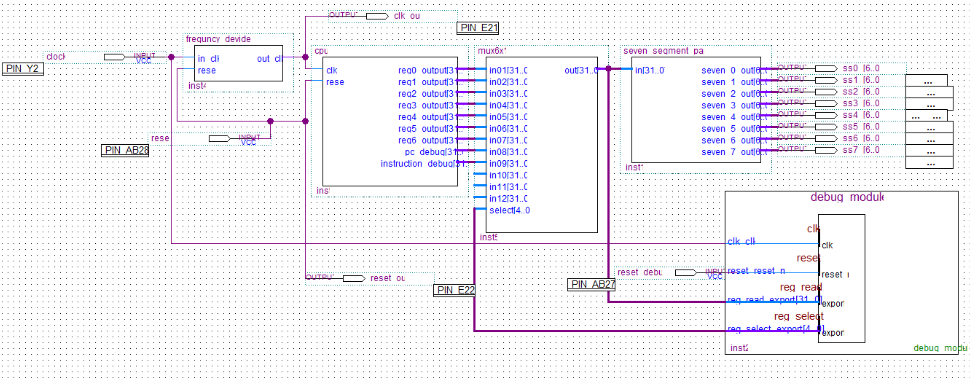

layout: home
permalink: index.html

repository-name: e16-4yp-Hardware-Cache-Switching-with-Operating-System-Context-Switches
title: Hardware Cache Switching with Operating System Context Switches

# Hardware-Cache-Switching-with-Operating-System-Context-Switches

#### Team

- E/16/332, Randika Viraj, [email](mailto:e16332@eng.pdn.ac.lk)
- E/16/222, Wshva Madushnaka, [email](mailto:e16222@eng.pdn.ac.lk)

#### Supervisors

- Dr.Isuru Nawinne, [email](mailto:isurunawinne@eng.pdn.ac.lk)
- Dr.Mahanama Wickramasingh, [email](mailto:mahanamaw@eng.pdn.ac.lk)
- Prof.Roshan Ragel, [email](mailto:roshanr@eng.pdn.ac.lk)
- Dr.Haris Javaid, [email](mailto:haris.javaid@amd.com)

#### Table of content

1. [Abstract](#abstract)
2. [Related works](#related-works)
3. [Methodology](#methodology)
4. [Experiment Setup and Implementation](#experiment-setup-and-implementation)
5. [Results and Analysis](#results-and-analysis)
6. [Conclusion](#conclusion)
7. [Publications](#publications)
8. [Links](#links)

---

## Abstract
Caches are used to improve the speed and efficiency of memory access. However, the optimal cache configuration depends on the application's memory access patterns. When a context switch occurs, the cache data of the current thread must be flushed, and new data from the new thread loaded, which can increase memory access time and energy usage.

To improve cache performance, various techniques and methods have been developed. We propose cache partitioning, which divides the cache into multiple partitions. The program can choose the most suitable cache at runtime by executing special instructions. This method reduces the interference between the cache contents of different processes that led to minimizing the context switch overhead.

## Related works
Due to the memory access pattern difference between the programs and the power consumption of the embedded systems, finding the best or nearly the best cache configuration becomes important. Various method has been proposed by many authors. Some of the methods consider only one particular cache parameter while some method considers all the cache parameters. 
A.Patel et al.(2006) propose an improved indexing schema for direct-mapped caches. This method decreases the number of conflict misses significantly by using application-specific data. Simply choose a subset of the address bit which can reduce the number of conflicts misses. This method only considers direct map cache. The method enables the best cache indexing to meet a specific application according to a re-configurable bit selector that can be configured at run time. Albonsei et al.(1999) propose a method called selective cache ways with a minor hardware modification that provides the ability to enable a subset of cache ways when the demand increases. When great performance is necessary, all cache ways are enabled. However, when cache demands are lower, only a portion of the ways are enabled. In this method, it reduces the power consumption with on-demand activation of the cache way. 

Memory data in the set associativity cache is not used across the sets. As a result of the cache's underutilization, performance suffers. Rolan et al.(2009) propose a method called “Set balancing” for balancing the set’s pressure. Set Balancing Cache or SBC moves lines from sets with high local miss rates to sets with underutilized lines, where they can subsequently be found. Zhang et al.(2003) propose new cache architecture that can be configured by software. By adjusting a few bits in a configuration register, the cache can be configured in software to be directly mapped or set associative while still utilizing the entire cache's capacity.

Gordon-Ross et al.(2007) introduce non-intrusive on-chip cache-tuning hardware modules that can predict the accurate best configuration for an executing program. Using this technique, addresses produced by a microprocessor are silently gathered. The ideal cache setup is then determined by further analysis of those data. The cache is then instantaneously updated to the most ideal configuration, never looking at inferior configurations. As a result, there is less energy usage and performance overhead, enabling more frequent cache adjustment. Zhang et al. (2004), propose a self-tuning cache architecture that adjusts its configuration based on program behavior to optimize performance. The authors use a feedback loop to adaptively adjust the cache parameters, such as cache size and associativity, to minimize the number of cache misses. Gordon-Ross and Vahid (2007), build on the previous work of Zhang et al. by proposing a configurable cache architecture that allows the cache to be reconfigured dynamically based on program behavior. The authors use a profiling technique to identify the most frequently accessed memory blocks and adjust the cache configuration accordingly.

## Methodology

Switchable Cache Bank System
As we have seen earlier, cache flushing and reloading take significant cost. It becomes a big overhead to context switching. So as the solution, we are proposing a switchable cache system. Which can switch the cache depending on the running thread.
In our solution, we have a set of cache banks with different cache configurations. These configurations are predetermined in the design time. Our work facilitates the use of distinct cache configurations with the most optimal settings for application-specific chip programs. We achieve this by providing numerous cache banks with preconfigured cache settings, optimized for specific programs. Users can select the most appropriate cache configuration for a particular program by utilizing a special instruction that has been added to the ISA. These cache configurations are established during the design stage, with the most appropriate configurations selected for the predefined programs. Programmers can then instruct the system to use the appropriate cache configuration by using the aforementioned special instruction. In cases where there are more programs than cache banks or for general program cases, a specialized hardware unit is employed to handle the situation. Whenever there is a context switch at thread switching, our specialized hardware selects the previously used cache so that any existing data on the cache is not flushed. This ensures that the program can continue without the need to reload the data into the cache, thereby reducing memory access.
In order to implement the cache bank system, we used a Switchable Cache developed by Nawinne et al.(2016) and developed it further to as our requirements. Fig. 1 gives an overview of the architecture of the proposed system.

  
      Fig 1 : Cache Architecture
  
As Fig. 1 indicates we have two multiplexers between the cache bank system and CPU, and the cache bank system and main memory. These are used to switch the cache banks as the os instructed to the cache controller system. In the four cache banks, we have dedicated one cache bank to  OS purposes. When the special instruction is executed and the signal is generated, the cache banks are switched using the multiplexers. Fig. 2 indicates, how the cache control system works.

  
  Fig 2 : Cache Control System
  
As Fig. 2 shows, we have  a control register which used to switch the caches and check the current cache. When the custom instruction which is added to ISA is executed on the CPU, it writes the control register. Depending on the value appropriate control signals are generated to switch the cache banks asynchronous. These signals are used by the multiplexers to switch the cache banks. The control register value is checked for the programmer to check the current cache bank status.
When the signal is received, the active cache core (which is the section of the cache currently being used) is switched to the OS cache. This is done to prevent any data cached from the previous task from being overwritten or flushed during the context switch. Once the OS cache is activated, the scheduler selects the next thread to execute from the list of ready threads. This list contains all of the threads that are currently waiting for the CPU to execute their instructions. When the thread is selected, the corresponding cache core assigned to that thread is activated. Each thread in a multi-threaded system is assigned a separate cache core, which allows them to operate independently without interfering with each other's cached data. Finally, the chosen thread begins its execution, and the CPU executes its instructions using the activated cache core. The thread will continue executing until it is interrupted by another context switch or completes its task.

## Experiment Setup and Implementation

In order to experiment with the cache bank control system, we have to implement a system that can switch the cache banks. For this purpose, we have implemented a standard Risc V five-stage pipeline processor. We have added the custom instruction and the cache bank system to that. For the implementation, we have used Qurtus II  software to test the implementation on the FPGA. Also, we have two custom assembly programs, one is used the single shared cache and the other is used the switchable cache bank system. Finally, a performance analysis that was conducted to assess the performance improvements of using a switchable cache bank system. The analysis likely involved measuring and comparing the performance of a system that used the switchable cache bank system against a similar system that did not use this feature. The results of the analysis would provide insight into the effectiveness of the switchable cache bank system and could be used to make informed decisions about implementing it in future systems.

### Hardware and Software Design
The hardware simulation environment was designed using Verilog. We have designed separate instruction and data memory systems. In our system cache banks, data memory, and instruction memory is modeled as it gives real functionality and timing. The memory hierarchy and the complete system implementation are indicated in Fig. 3.

  
  Fig 3 : Memory Hierarchy and the Complete System Implementation
  
As indicated in Fig. 3, we have modeled the complete system in FPGA using the logic and flip-flop cells on the board. Switchable Cache, which was designed to improve the performance of a computer system. To optimize the cache for different applications, the cache cores were created with different cache configurations that suit the specific requirements of each application. A cache can be configured in a number of ways, including block size, set size, and associativity. These configuration options impact the performance of the cache, and the optimal configuration for a specific application is dependent on the memory access pattern of that application. In other words, different applications require different cache configurations in order to achieve the best possible performance. By creating cache cores with different configurations, the Switchable Cache is able to provide each application with the most suitable configuration, which helps to improve the overall performance of the system. 
As shown in Fig. 4, we have implemented the five-stage pipeline processor.

  
  Fig 4 : Five-stage Pipeline Processor
  
In the pipeline processor, we have added a custom opcode to the instruction decode stage to generate the control signal to write the cache control register. We are getting cache values from the func3 field in the standard ISA instruction word as indicated in Fig. 5.

  
  Fig 5 : Custom Instruction Format for Cache Switching
  
We have to use the OS cache  as the default cache  and we have defined the cache bank selection values as indicated below

 - Cache OS - 000
 - Cache 01  - 001
 - Cache 02 - 010
 - Cache 03 - 011
 
 
One way to do this is by implementing a custom instruction decode stage in the pipeline. This allows the processor to recognize specific instructions, and execute them more efficiently.
The cache bank number comes in by passing this information to the decode pipeline register, the cache is configured to write the specific cache bank value that is most appropriate for the current application to the cache control register. To ensure that the previous instruction is not affected by the change in cache bank value, the cache bank value is written to the control register in the memory accessing stage. This allows the cache to switch between banks without affecting the execution of the previous instruction, which helps to maintain the overall stability and efficiency of the system. Finally, it is important to ensure that the cache is able to communicate effectively with the main memory in order to transfer data back and forth. This is accomplished by switching the CPU to the cache bank and banks to the main memory buses on the control register.

In the software design, we implemented the assembly program sequence to add the two vectors together. We have two programs that are running as two threads both programs are independently adding two vectors. Since we haven’t used an OS we have to develop the preemptive threads and scheduling in a hard-coded way. We have developed a custom program with these functionalities at the assembly level. For reference, we have given the instruction sequence in a high-level manner.

The below given high-level program indicates the assembly sequence we have used without using a switchable cache system and using a shared cache.

    //Frist Thread strating
    int a[8]={1,2,3,4,5,6,7,8};
    int b[8]={1,2,3,4,5,6,7,8};
    int result=0;
    result = result + (a[0] * b[0]);
    result = result + (a[1] * b[1]);
    result = result + (a[2] * b[2]);
    result = result + (a[3] * b[3]);

    //Save the context of frist thread to memory
    saveContext(contextAdress);

    //Secound thread starting
    int a[8]={0,1,2,4,5,6,0,8};
    int b[8]={0,1,2,4,5,6,7,1};
    int result=0;
    result = result + (a[0] * b[0]);
    result = result + (a[1] * b[1]);
    result = result + (a[2] * b[2]);
    result = result + (a[3] * b[3]);

    //Frist Thread strating
    int a[8]={1,2,3,4,5,6,7,8};
    int b[8]={1,2,3,4,5,6,7,8};
    int result=0;
    result = result + (a[0] * b[0]);
    result = result + (a[1] * b[1]);
    result = result + (a[2] * b[2]);
    result = result + (a[3] * b[3]);

    //Save the context of frist thread to memory
    saveContext(contextAdress);

    //Secound thread starting
    int a[8]={0,1,2,4,5,6,0,8};
    int b[8]={0,1,2,4,5,6,7,1};
    int result=0;
    result = result + (a[0] * b[0]);
    result = result + (a[1] * b[1]);
    result = result + (a[2] * b[2]);
    result = result + (a[3] * b[3]);

Below given high-level program indicates the assembly sequence we have used with using switchable cache system.

    switchCacheBank(1);
    //Frist Thread strating
    int a[8]={1,2,3,4,5,6,7,8};
    int b[8]={1,2,3,4,5,6,7,8};
    int result=0;
    result = result + (a[0] * b[0]);
    result = result + (a[1] * b[1]);
    result = result + (a[2] * b[2]);
    result = result + (a[3] * b[3]);

    //Save the context of frist thread to memory
    saveContext(contextAdress);
    switchCacheBank(2);

    //Secound thread starting
    int a[8]={0,1,2,4,5,6,0,8};
    int b[8]={0,1,2,4,5,6,7,1};
    int result=0;
    result = result + (a[0] * b[0]);
    result = result + (a[1] * b[1]);
    result = result + (a[2] * b[2]);
    result = result + (a[3] * b[3]);
    //Save the context of secound thread to memory
    saveContext(contextAdress+32*4);

    switchCacheBank(1);
    //Load the context of frist thread from memory
    loadContext(contextAdress);

    result = result + (a[4] * b[4]);
    result = result + (a[5] * b[5]);
    result = result + (a[6] * b[6]);
    result = result + (a[7] * b[7]);

    //Save the context of frist thread to memory
    saveContext(contextAdress);

    switchCacheBank(2);
    //Load the context of secound thread from memory
    loadContext(contextAdress+32*4);

    result = result + (a[4] * b[4]);
    result = result + (a[5] * b[5]);
    result = result + (a[6] * b[6]);
    result = result + (a[7] * b[7]);

We have tested these two assembly sequences in our developed system. Since we are using separate instruction memory. It is not affected by the system. Also, advanced concepts such as virtual memory and other os level overheads are not counted in our system. Since we have a hardware-level hazard handling unit in our implemented system, the cost for hazard handling at the software level is also reduced.

### FPGA Experimental System Implementation

We used the Altera FPGA (device family "Cyclone IV E"
and the device "EP4CE115F29C7N") as the emulator for the system testing,

For the synthesis part, and for creating a netlist for FPGA we used “Quartus II 12.1 (32.bit)" software to program the FPGA. Our system has two components that are programmed into the FPGA board.

 1. Risc V pipeline processor and the memory system as described on the early sections
 2. Debugging unit: For easy debugging, the debugging unit was implemented. Using Quartus II Qsys, the debugging module was implemented. It was implemented with Nios 2 processor and PIO port. Each output was captured by debugging the module and shown in the Nios II software build tool. The debugging unit implemented using Quartus II Qsys consists of the following components:

  - Nios 2 Processor: The Nios 2 processor is a soft-core processor that is implemented on the FPGA. It is a general-purpose processor that can be programmed to perform various tasks.

  - PIO Port: The PIO port is a programmable input/output block that can be used to interface with external devices. It can be programmed to handle various types of inputs and outputs, such as data, signals, and control signals.

  - Avalon Memory Mapped Interface (MMI): The Avalon MMI is a standard interface used to connect intellectual property (IP) blocks in Quartus II Qsys. The debugging module is connected to the Avalon MMI, which allows it to communicate with the other IP blocks in the system.

  
  Fig 6 : Block Diagram of the System(in Quartus II)

  
## Results and Analysis

## Conclusion

## Publications
1. [Semester 7 report](./)
2. [Semester 7 slides](./)
3. [Semester 8 report](./)
4. [Semester 8 slides](./)
5. Author 1, Author 2 and Author 3 "Research paper title" (2021). [PDF](./).

## Links

[//]: # ( NOTE: EDIT THIS LINKS WITH YOUR REPO DETAILS )

- [Project Repository](https://github.com/cepdnaclk/repository-name)
- [Project Page](https://cepdnaclk.github.io/repository-name)
- [Department of Computer Engineering](http://www.ce.pdn.ac.lk/)
- [University of Peradeniya](https://eng.pdn.ac.lk/)

[//]: # "Please refer this to learn more about Markdown syntax"
[//]: # "https://github.com/adam-p/markdown-here/wiki/Markdown-Cheatsheet"
